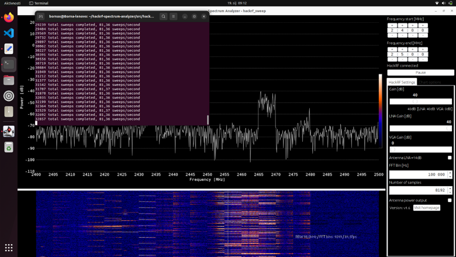
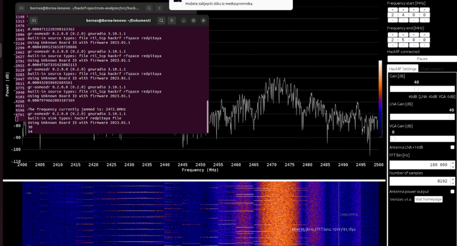

# HackRF One WiFi Jamming & Spectrum Analysis Toolkit

This project is a Python-based software-defined radio (SDR) tool designed to scan, detect, and disrupt wireless communications on target frequency bands. Utilizing a HackRF One device and OsmoSDR flow graphs, the script systematically monitors channel activity and selectively executes targeted interference to study wireless spectrum vulnerabilities.

## 📖 Introduction & Motivation

Understanding wireless communication vulnerabilities is essential for building resilient defense strategies. Jamming mechanisms are classified by both their **transmission pattern**:

* **Constant Jamming:** Emits signals continuously across a target frequency to block channel access.
* **Transition Jamming:** Shifts across multiple frequency channels systematically.
* **Random Jamming:** Emits interference across pseudo-random frequencies or time slots.

and their **reactivity**:
* **Proactive Jamming ("Blind"):** Transmits interference continuously or blindly regardless of whether actual network traffic is present.
* **Reactive Jamming ("Smart"):** Remains idle and monitors the channel, triggering transmission **only** when active communication or traffic is detected.

> **What This Project Uses:**
> This project specifically implements **Reactive Transition Jamming**. It systematically transitions (hops) across multiple frequency channels, uses a sensing function to evaluate channel activity against a power threshold and reactively triggers jamming transmissions only when active channel usage is identified.

## 🛠️ Technologies

* **HackRF One:** The primary SDR hardware peripheral used for real-time radio frequency operations. The project specifically employes a dual-device configuration:
  * *Device 1:* Dedicated to passive data collection and channel sensing (`sense`).
  * *Device 2:* Dedicated to active jamming and disrupting the targeted channel (`jam`).
* **HackRF Spectrum Analyzer:** A companion visualization interface and analysis tool used for real-time monitoring of spectrum usage, channel activity, and the visual impact of jamming operations (hardware specs and utility details can be found via the [HackRF Spectrum Analyzer repository](https://github.com/pavsa/hackrf-spectrum-analyzer)).
* **SMA Cable:** Utilized for physically connecting and ensuring precise hardware synchronization between the devices.
* **GNU Radio:** Acts as the graphical framework used to design signal processing flow graphs by arranging functional blocks. Once the blocks are configured, GNU Radio automatically generates the underlying Python code required to execute the flow graph logic, handling both hardware interfacing and signal stream manipulation.
* **Linux OS Environment:** The central host operating system required for low-level device control, script execution and configured USB user permissions.


## ⚙️ Code Logic

The script relies on a continuous scanning loop driven by core functional components:

* **`set_freq(freq)`:** 
  Dynamically tunes the SDR hardware to the target frequency, ensuring seamless channel switching during the transition-hopping phase without restarting the entire flow graph.
* **`sense(freq, delay)`:** 
  Tunes the SDR source to the target frequency and reads incoming samples over a short sensing duration (`T_SENSING`). Passes the captured signal through a low-pass filter and a magnitude squared block, writing the raw power output data to a temporary file (`output.bin`).
* **`detect()`:** 
  Evaluates the power data from `output.bin` against a predefined power `THRESHOLD` to check for active channel utilization and decides whether disruption is necessary.
* **`jam(freq, waveform, power, delay)`:** 
  Triggered only when the sensed power exceeds the active threshold. Configures the selected jamming waveform (such as Gaussian noise or tones) and sets transmission radio frequency gains based on power parameters, automatically executing the active disruption signal on the target frequency for the specified duration (`T_JAMMING`).

> **Note:**
> GNU Radio provides the underlying code skeleton for hardware communication and core signal processing (such as stream connections, flow graphs, and block initializations). Custom logic (including the scanning loop, `set_freq`, channel sensing threshold evaluations and conditional `jam` triggers) is then built around this generated foundation to control real-time reactive behavior.

## 🚀 Setup and Configuration

To run this script successfully, ensure your environment meets the following requirements:

### Dependencies & OS
* **Operating System:** A Linux system with GNU Radio (v3.8+) and the `osmosdr` Python modules installed, along with other required Python dependencies.
* **Required System Packages:** Ensure the following packages are installed (exact names depend on your Linux distribution):
```bash
sudo apt install libusb-1.0 libfftw3-bin default-jdk
```
* **USB Permissions:** Configure `udev` rules for HackRF to allow the `libusb` library to open the HackRF USB device, as it will not work by default without these permissions. Follow the [HackRF USB permissions setup](https://github.com/mossmann/hackrf/wiki/FAQ) if you need help.

### Hardware & Physical Connections
* **SDR Setup:** Connect the HackRF One devices to your Linux machine using Micro-USB cables.
* **I/O ports:** Connect an SMA cable directly between the two HackRF devices.
* **Device Identification:** Check the device serial numbers and map them to the correct roles in the code under the `args` parameter (to distinguish between sensing and jamming devices).
```python
  osmosdr_source = osmosdr.source(
      args="numchan=" + str(1) + " " + ""
  )
```
### Global Configuration Parameters (Optional)
Adjust these variables directly within the script if you wish to modify your testing parameters:

* `BAND` - Select Frequency operating range (1=2.4GHz, 2=5GHz)
* `WAVEFORM` - Select Jamming waveform (1=single tone, 2=swept sine, 3=gaussian noise)
* `POWER` - Enter Jammer transmit power in dBm (Min = -40dBm, Max = 13dBm)
* `T_JAMMING` - Enter channel jamming duration in seconds
* `DURATION` - Enter total program execution duration in seconds
* `T_SENSING` - Enter channel sensing duration in seconds
* `THRESHOLD` - Power threshold for activity detection

### Startup Procedure
1. **Visualization:** Clone and set up the companion [HackRF Spectrum Analyzer](#Technologies) repository. To run, simply execute:
   
```bash
   ./build/hackrf_sweep_spectrum_analyzer_linux.sh
```
2. **Execution:** Run the core Python script to initiate the automated scanning and reactive jamming loop:
   
```bash
python3 jamRF.py
```

## 📊 Visual Analysis of Spectrum Activity and Jamming

Using tools like the HackRF Spectrum Analyzer graphical interface, we can visualize spectrum usage and the real-time impact of reactive jamming:

* **Channel Analysis / Normal Activity:** During the sensing phase, the spectrum analyzer displays background noise and occasional communication peaks. The tool's GUI highlights active communication areas in warmer colors (such as red/orange zones in the waterfall display) while idle or quiet spectrum ranges are represented in cooler tones (blue).

<div align="center">
  
</div>
<br>


* **Active Jamming Execution:** Once the `detect()` function registers power values exceeding the set `THRESHOLD`, the script targets that specific frequency channel and executes `jam()`. On the spectrum analyzer waterfall view, this appears as a sudden, intense broadband or noise burst spanning across the jammed channel, disrupting any legitimate data transmission occurring there.

<div align="center">
  
</div>
<br>

## 🛡️ Mitigation and Defense Against Reactive Jamming

Defending against reactive and transition-based jamming attacks requires resilient wireless network architectures:

* **Frequency Hopping Spread Spectrum (FHSS):** Devices constantly and rapidly switch the channels they communicate on. Because a reactive jammer must first sense where transmission is happening before it can interfere, the device has already jumped to a brand new frequency by the time the jammer reacts, leaving it wasting energy on empty channels.
* **Error-Correcting Codes (DSSS and Coding):** Special mathematical protection codes are added to the data. If the jammer manages to disrupt only a portion of the transmission, the receiver can still successfully reconstruct and read the entire message using these codes.
* **Detection and Monitoring Systems:** The network continuously monitors signal quality and sudden drops in data delivery. When weird anomalies are detected, the system immediately recognizes a jamming attack and can switch to backup defense protocols.
